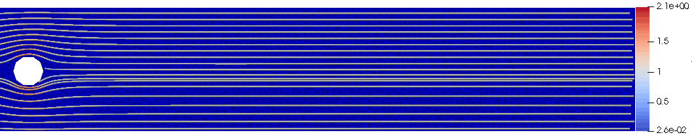

| - | - |
|---|---|
|  |  |

## Curriculum Vitae
### Antecedentes personales
Nombre: Víctor Andrés Osores Escalona  
Fecha de Nacimiento: 10 de Agosto de 1988  
Nacionalidad: Chilena  
Email: vosores@ucm.cl  
Página personal: [https://victorosores.github.io](https://victorosores.github.io)
### Afiliación
Académico e investigador  
Departamento de Matemática, Física y Estadística  
Facultad de Ciencias Básicas  
<a href="https://portal.ucm.cl">Universidad Católica del Maule</a>  
Talca, Chile.

### Títulos y grados

- Doctor en ciencias aplicadas con mención en ingeniería matemática, Universidad de Concepción.
- Ingeniero civil matemático, Universidad de Concepción.
- Diplomado en innovación en enseñanza de las Ciencias, <a href="https://portal.ucm.cl">Universidad Católica del Maule</a>, Talca, Chile, Abril 2023.
- Licenciado en ciencias de la ingeniería matemática, Universidad de Concepción.

### Líneas de Especialización

- Análisis numérico de ecuaciones diferenciales parciales.
- Modelamiento matemático de procesos de sedimentación polidispersa.
- Sistemas de ecuaciones diferenciales hiperbólicos con productos no conservativos.
- Métodos numéricos para sistemas de EDP’s hiperbólicas con productos no conservativos.
- Modelos shallow water multicapa para sedimentación polidispersa.

### Líneas de Investigación
- Análisis numérico de ecuaciones diferenciales parciales.
- Sistemas de ecuaciones diferenciales hiperbólicos con productos no conservativos.
- Modelos matemáticos para enfermedades infecciosas provocadas por virus (SARS-CoV-2).
- Modelamiento matemático de procesos de sedimentación polidispersa sobre ríos y estuarios.
- Modelos shallow water multicapa para sedimentación polidispersa.
- Diseño de métodos numéricos eficientes. Simulación numérica de procesos de sedimentación, arrastre de sedimento, tsunamis.
- Mecánica de fluidos. Teoría de mezclas. Separación sólido-fluido. Sedimentación.
- Modelos shallow water multicapa sobre canales inclinados.
- Computación científica (Fortran90, Python, Matlab, R).
- Desarrollo de la herramienta SRT (South Rivers Toolbox). Modelo predictor de cambios morfodinámicos en ríos para ayudar a la gestión de cauces (Proyecto Innova Chile CORFO 19BP-117424).
- Diseño de herramientas para QGIS (Sistema de Información Geográfica open source) y Análisis de imágenes satelitales.
- Modelos lluvia-escorrentía.

****
### Publicaciones
#### Articles in progress
0. **Víctor Osores**, **Francisca Tapia-Donoso**, *Polydisperse sedimentation processes and transport of non-cohesive and cohesive sediment suspensions with different sizes and densities*.

0. **Rodrigo Gutiérrez**, **Víctor Osores**, **Nelson A. Velasquez**, *Spatio-temporal dynamics of anuran male choirs as an energetically limited swarmalator system*.
{: reversed="reversed"}

#### Preprints Under Review
0. **Julio Careaga**, **Víctor Osores**, *A multilayer shallow water model for polydisperse reactive sedimentation*. **Preprint 2024-01**.

0. **Nicole Martínez-Jeraldo**, **Alejandro Rojas-Palma**, **Marcos Carrasco-Benavides**, **Víctor Osores**: *A mathematical model for the estimation of stomatal conductance under environmental variables*. **Preprint 2024-01**
{: reversed="reversed"}

#### Papers in Scientific Journals
0. **Santiago Yépez**, **Francisca Salas**, **Andrea Nardini**, **Noelia Valenzuela**, **Víctor Osores**, **José Vargas**, **Rolando Rodríguez**, **Hervé Piégay**: *Semi-automated morphological characterization using South Rivers Toolbox*. **IAHS2022–Variability and change across space, time, extremes, and interfaces**. (2023).
~~~
@article{piahs-385-189-2024,
  author = {Y\'epez, S. and Salas, F. and Nardini, A. and Valenzuela, N. and Osores, V. and Vargas, J. and Rodr\'{\i}guez, R. and Pi\'egay, H.},
  title = {Semi-automated morphological characterization using South Rivers Toolbox},
  journal = {Proceedings of IAHS},
  volume = {385},
  year = {2024},
  pages = {189--196},
  url = {https://piahs.copernicus.org/articles/385/189/2024/},
  doi = {10.5194/piahs-385-189-2024}
}
~~~
0. **Francisca Salas, Santiago Yépez, José Vargas, Rolando Rodríguez, Víctor Osores, Andrea Nardini, Hervé Piégay**: *"Morphological characterization of the duqueco river applying the river styles framework*. **Revista de la Sociedad Chilenade Ingeniería HidráulicaEdition (SOCHID)**, vol 37, Num. 3, (2022).

0. **Neftali Flores**, **Rolando Rodríguez**, **Santiago Yepez**, **Víctor Osores**, **Pedro Rau**, **Francisco Balocchi**: *Calibration and validation of three hydrological models of daily rainfall applied in four small watersheds in south-central chile*. **Water**, (2021).
~~~
@article{Flores2021,
  title = {Comparison of Three Daily Rainfall-Runoff Hydrological Models Using Four Evapotranspiration Models in Four Small Forested Watersheds with Different Land Cover in South-Central Chile},
  volume = {13},
  ISSN = {2073-4441},
  url = {http://dx.doi.org/10.3390/w13223191},
  DOI = {10.3390/w13223191},
  number = {22},
  journal = {Water},
  publisher = {MDPI AG},
  author = {Flores,  Neftali and Rodríguez,  Rolando and Yépez,  Santiago and Osores,  Victor and Rau,  Pedro and Rivera,  Diego and Balocchi,  Francisco},
  year = {2021},
  month = nov,
  pages = {3191}
}
~~~

0. **Raimund Bürger**, **Enrique D. Fernández-Nieto**, **Víctor Osores**: *A multilayer shallow water approach for polydisperse sedimentation with sediment compressibility and mixture viscosity*. **Journal of Scientific Computing**, (2020).
~~~
@article{Brger2020,
  title = {A Multilayer Shallow Water Approach for Polydisperse Sedimentation with Sediment Compressibility and Mixture Viscosity},
  volume = {85},
  ISSN = {1573-7691},
  url = {http://dx.doi.org/10.1007/s10915-020-01334-6},
  DOI = {10.1007/s10915-020-01334-6},
  number = {2},
  journal = {Journal of Scientific Computing},
  publisher = {Springer Science and Business Media LLC},
  author = {B\"{u}rger,  Raimund and Fernández-Nieto,  Enrique D. and Osores,  Víctor},
  year = {2020},
  month = nov 
}
~~~

0. **Raimund Bürger**, **Enrique D. Fernández-Nieto**, **Víctor Osores**: *A dynamic multilayer shallow water model for polydisperse sedimentation*. **ESAIM: Mathematical Modelling and Numerical Analysis**, (2019).
~~~
@article{Brger2019,
  title = {A dynamic multilayer shallow water model for polydisperse sedimentation},
  volume = {53},
  ISSN = {1290-3841},
  url = {http://dx.doi.org/10.1051/m2an/2019032},
  DOI = {10.1051/m2an/2019032},
  number = {4},
  journal = {ESAIM: Mathematical Modelling and Numerical Analysis},
  publisher = {EDP Sciences},
  author = {B\"{u}rger,  Raimund and Fernández-Nieto,  Enrique D. and Osores,  Víctor},
  year = {2019},
  month = jul,
  pages = {1391–1432}
}
~~~
{: reversed="reversed"}

#### Articles in Proceedings or Book Chapters

0. **Raimund Bürger**, **Julio Careaga**, **Stefan Diehl**, **Víctor Osores**, **Luis M. Villada**: *Mathematical Modelling in Sedimentation. Lecture Notes*. **Escuela de Primavera de Análisis Numérico (EPANUM 2019)**, Universidad de Concepción, 21-25 October 2019 (57 pp).

0. **Raimund Bürger**, **Víctor Osores**: *On the mathematical and numerical treatment of polydisperse sedimentation*. **Proceedings of the International Conference on Numerical Analysis, Computing and Applications in Science, Engineering and Technology (ICNumACA’18)**, (2018).
{: reversed="reversed"}

****
### Proyectos de investigación

#### Supported by <a href="https://portal.ucm.cl">Universidad Católica del Maule</a>
0. 
<strong>Principal Researcher</strong> in UCM-IN-24200 internal grant. <i>Modelos espacio-temporales para estudiar la propagación de enfermedades infecciosas y de plagas en plantaciones</i>. (2024-2025).  
<strong>Co-Researcher</strong> Leidy Yissedt Lara-Díaz.

{: reversed="reversed"}

#### Other research projects
0. 
Proyecto Innova Chile – CORFO Bienes Públicos Adaptación al Cambio Climático. 19BP-117424 – South Rivers Toolbox: Modelo predictor de la morfodinámica fluvial para apoyar la gestión de cauces.
Participación: Investigador y programador software South Rivers Toolbox.

0. 
CONICYT/PIA/Concurso Apoyo a Centros Científicos y Tecnológicos de Excelencia con Financiamiento Basal (AFB170001).
Participación: Investigador Postdoctoral.

0. 
Proyecto CONICYT/FONDAP (15130015). Centro de Recursos hídricos para la agricultura y la minería (CRHIAM).
Participación: Colaborador en investigación.

0. 
Anillo de investigación en Análisis numérico de Ecuaciones Diferenciales Parciales (ANANUM), ACT-1118
Participación: Ayudante de investigación.

0. 
Proyecto UCO 1124, Dirección de Docencia de la Universidad de Concepción.
Participación: Tutor de matemáticas en Centro de Apoyo al Desarrollo del Estudiante (CADE).

{: reversed="reversed"}

****
### Cargos  
#### Cargo actual
- Académico e investigador en <a href="https://portal.ucm.cl">Universidad Católica del Maule</a>.
- Director Subrogante Escuela de <a href="https://prenovato.ucm.cl/carreras/ingenieria-matematica/">Ingeniería Matemática</a>, Universidad Católica del Maule.

#### Cargo previo
- Docente Part-time,  
Universidad de Concepción.
- Docente Part-time,  
Universidad Católica de la Santísima Concepción.
- Postdoctorando en Departamento de Ingeniería Informática y Ciencias de la Computación, Unidad data science,  
Modelamiento matemático y simulación numérica del SARS-Cov-2.  
Universidad de Concepción.
- Postdoctorando en el Centro de Investigación en Ingeniería Matemática (CI²MA),  
Métodos numéricos para EDP hiperbólicas.  
Universidad de Concepción.
- Investigador y desarrollador de la herramienta South Rivers Toolbox bajo el proyecto CORFO código 19BP-117424.

****
### Talks
#### Organización de eventos
0. 
<b>Coordinador</b> sesión Temática de <i>Análisis No Lineal y Ecuaciones Diferenciales</i> en la XXXVI Jornada de Matemática de la Zona Sur (2024).

0. 
<b>Co-Organizador</b> sesión de <i>Modelamiento Matemático</i> en la XXXV Jornada de Matemática de la Zona Sur (2023).

{: reversed="reversed"}

#### Charlas en universidades

- 
<a href="https://portal.ucm.cl">Universidad Católica del Maule</a>[Abril 2022]
Departamento de Matemática, Física y Estadística
Talca-Chile
Título: Modelos matemáticos: importancia y como enfrentarlos.

- 
Universidad de Tarapacá
Departamento de Matemática
Arica-Chile
Título: Sistemas shallow water multicapa para sedimentación polidispersa.

- 
Lund University
Centre for Mathematical Sciences Lund
Lund-Sweden
Título: A dynamic multilayer shallow water model for polydisperse sedimentation.

#### Congresos y seminarios (Expositor)
- 
Universidad Militar Nueva Granada, Colombia, (2023)  
IX Coloquio de Matemáticas Aplicadas y V Encuentro Internacional de Matemáticas Aplicadas  
Titulo:  Modelamiento matemático de procesos de sedimentación polidispersa y aplicaciones.

- 
<a href="https://portal.ucm.cl">Universidad Católica del Maule</a>, Talca, Chile, Septiembre, (2022).  
Segunda jornada de investigación: Creando y enseñando Ciencia con Ciencia
Titulo: Modelos de sedimentación polidispersa y aplicaciones.

- 
<a href="https://portal.ucm.cl">Universidad Católica del Maule</a>, Talca, Chile, Agosto, (2022).  
Proyecto DoCienciaUCM (UCM1999)  
Titulo: Una mirada a mi experiencia docente: Enseñanza y aprendizaje del contenido y el uso de tecnología.

- 
<a href="https://portal.ucm.cl">Universidad Católica del Maule</a>, Talca, Chile, Abril, (2022).  
Titulo: Modelos matemáticos: importancia y como enfrentarlos.

- 
Universidad de Concepción  
WONAPDE 2019  
Sixth Chilean Workshop on Numerical Analysis of Partial Differential Equations.  
Título: A multilayer shallow water model for polydisperse sedimentation with sediment compressibility and mixture viscosity.

- 
Universidad de Antofagasta
COMCA 2018
Antofagasta-Chile
XXVII Congreso de Matemáticas Capricornio.
Título: A dynamic multilayer shallow water model for polydisperse sedimentation.

- 
University Park
HYP 2018
Pennsylvania-USA
XVII International Conference on Hyperbolic Problems Theory, Numerics, Applications.
Título: An improved polydisperse sedimentation model and multilayer approximation with finite volume methods.

- 
Pontificia Universidad Católica de Chile
Santiago Numérico III
Santiago-Chile
Ninth Meeting on Numerical Analysis of Partial Differential Equations.
Título: Polydisperse sedimentation in inclined channels.

- 
Universidad Católica del Norte
COMCA 2016
Antofagasta-Chile
Sesión Invitada Análisis Numérico de Ecuaciones en Derivadas Parciales.
Título: Métodos de alto orden para sistemas hiperbólicos con productos no conservativos, aplicados a sistemas shallow water multicapa con sedimentación polidispersa.

- 
Universidad de Concepción
CRHIAM-INOVAGRI Chile
Concepción-Chile
Leading Technologies for water managegement.
Título: Polydisperse sedimentation: Theory, numerics and applications.

- 
Universidad Arturo Prat
COMCA 2015
Iquique-Chile
Sesión de Análisis Numérico para resolución de Ecuaciones Diferenciales Parciales.
Título: Modelamiento matemático y simulación numérica de un sistema de shallow water multicapa con sedimentación polidispersa en dos dimensiones horizontales.

#### Congresos y seminarios (Asistencia)

- 
Universidad de Concepción[Julio 2022]
5th CI²MA workshop
Concepción-Chile
Mathematical modelling and simulation for bioprocesses, wastewater treatment and mineral processing.

- 
Universidad de Concepción
Fourth CI2MA Workshop
Concepción-Chile
Mathematical Models in Epidemiology.

- 
Universidad de Concepción
WONAPDE 2016
Concepción-Chile
Fifth Chilean Workshop on Numerical Analysis of Partial Differential Equations.

- 
Universidad de Concepción
10th CI2MA Focus Seminar
Concepción-Chile
Numerical methods for hyperbolic and related problems.

- 
Universidad de La Serena
La serena numérica II
La Serena-Chile
Encuentro de Análisis Numérico de Ecuaciones Diferenciales Parciales.

- 
Universidad de Sevilla
Meeting on Numerical challenges in two-phase flows
Escuela Superior de Ingenieros
Sevilla-España.

- 
Universidad de Concepción
9th CI2 MA Focus Seminar
Concepción-Chile
Modelling and Numerical Simulation in Wastewater Treatment.

- 
Universidad de Antofagasta
COMCA 2012
Antofagasta-Chile
Sesión de Análisis Numérico para resolución de Ecuaciones Diferenciales Parciales.

****
### Experiencia académica e investigación

- 
Universidad de Concepción,  
Docente Part-time en el Departamento de Ingeniería Matemática, Facultad ciencias Físicas y Matemáticas,  
Concepción-Chile.

- 
Universidad Católica de la Santísima Concepción,  
Docente Part-time en el Departamento de Matemática y Física Aplicadas,  
Concepción-Chile.

- 
Universidad de Concepción,  
Tesista Doctorado en cs. Aplicadas con mención en Ingeniería Matemática,  
CI2MA and Departamento de Ingenierı́a Matemática, Facultad de Ciencias Físicas y Matemáticas,  
Concepción-Chile.

- 
Universidad de Sevilla,  
Estadía de colaboración en trabajos de investigación,
Instituto de Matemáticas Universidad de Sevilla Antonio de Castro Brzezicki (IMUS),  
Sevilla-España.

- 
Universidad de Sevilla,  
Estadía de colaboración en trabajos de investigación,  
Departamento de Matemática Aplicada I, E.T.S. Arquitectura,  
Sevilla-España.

- 
Universidad de Concepción,  
Tesista de Pregrado en Ingeniería civil matemática,  
Título: Modelamiento Matemático y Simulación Numérica de un Sistema Shallow Water Multicapa con Sedimentación Polidispersa en Dos Dimensiones Horizontales.  
Advisor: Raimund Bürger.  
Concepción-Chile.

- 
Universidad de Sevilla,  
Estadía de colaboración en trabajos de investigación,  
Departamento de Matemática Aplicada I, E.T.S. Arquitectura,  
Sevilla-España.

- 
Universidad de Concepción,  
Ayudante de cátedra en diferentes asignaturas:  
Álgebra, Álgebra lineal, Cálculo I, Cálculo II, Ecuaciones diferenciales ordinarias.  
Departamento de Ingeniería Matemática, Concepción-Chile.

- 
Universidad de Concepción,  
Consultor en sala de estudios de la Facultad de Ciencias Físicas y Matemáticas.  
Dar respuesta a consultas de los estudiantes de la Facultad en asignaturas de los primeros tres años de carrera. Álgebra, Álgebra lineal, Cálculo I, Cálculo II, Calculo III, Ecuaciones diferenciales (EDO, EDP), Análisis numérico, entre otras. Departamento de Ingeniería Matemática.  
Concepción-Chile.

****
### Cursos

- 
Comunidad de aprendizaje IDEClab: Instalación y primeros pasos en MANIM (Mathematical ANIMation), 
Dirección de Docencia, Universidad de Concepción.

- 
Lineamientos Pedagógicos para la docencia no presencial 2020-1 de la UCSC, 
Centro Innovación y Desarrollo Docente, Universdad Católica de la Santísima Concepción.

- 
Prevención COVID-19 en tu lugar de Trabajo-(G13) de la Universidad de Concepción, 
Servicios de Capacitación UdeC Ltda.

- 
Enseñanza online con Canvas y Teams, 
Dirección de Docencia, Universidad de Concepción.

- 
Version Control Systems for Mathematical Researchers,   
Instituto de Matemáticas Universidad de Sevilla Antonio de Castro Brzezicki (IMUS).

****
### Becas y Reconocimiento
- Reconociemiento a la innovación docente. <a href="https://portal.ucm.cl">Universidad Católica del Maule</a>, (2023).
- Beca de Doctorado nacional (CONICYT).
- Beca CRHIAM (Centro de Recursos Hídricos para la Agricultura y la Minería).

****
### Experiencia laboral privada y social

- 
AES Gener S.A
Práctica Profesional
Santiago-Chile
Central Hidroeléctrica Alfalfal Complejo Cordillera, Ruta G 345 km 23.
Predicción de la cantidad de sedimento a través de rodetes en turbinas de generación de energía eléctrica (sedimento turbinado), en busca diseñar informes acerca del desgaste de los rodetes. Se han usado técnicas estadísticas.

- 
Preuniversitario rural
Profesor de matemáticas en preuniversitario en Quillón
Quillón-Chile.

****
### Idiomas

- Inglés.
- Español.

****
### Conocimientos de computación

- Sistemas operativos: Linux, Windows.
- Estructura de documentos: LaTeX, Tikz.
- Lenguaje de programación: Matlab, Paraview, Fortran 90, Python, CUDA, R.
- Desarrollo colaborativo: Git, GitHub, GitKraken.

****
### Formación Académica

#### Educación Básica

- Escuela Silvestre Paiva Manríquez
1st–6th
Cauquenes-Chile  
- Escuela Dr. Francisco Meza
7th–8th
Cauquenes-Chile

#### Educación Media

- Liceo Claudina Urrutia de Lavín
1st–4th
Cauquenes-Chile

#### Educación Superior

- Ingeniería civil matemática, Universidad de Concepción, Concepción-Chile.  
**Título Tesis:** <a href="https://www.ci2ma.udec.cl/publicaciones/tesispregrado/egresado.php?id=29" target="_blank">Modelamiento matemático y simulación numérica de un sistema de shallow water multicapa con sedimentación polidispersa en dos dimensiones horizontales.</a>  
**Director(es) de Tesis:** Raimund Bürger, Enrique D. Fernández-Nieto.
- Doctorado en ciencias aplicadas con mención en ingeniería matemática, Universidad de Concepción, Concepción-Chile.  
**Título Tesis:** <a href="https://www.ci2ma.udec.cl/publicaciones/tesisposgrado/graduado.php?id=69" target="_blank">Sistema shallow water multicapa para sedimentación polidispersa: Teoría, Análisis numérico y Aplicaciones.</a>  
**Director(es) de Tesis:** Raimund Bürger, Enrique D. Fernández-Nieto.

****
### Teaching

En esta sección, te doy la bienvenida a un espacio donde convergen creaciones, recopilaciones, diseño de material (listados, talleres, pruebas, apuntes, otros) relacionadas con las actividades curriculares que he dictado durante las diferentes etapas de mi trayectoria laboral. Encontrarás material tanto de mis experiencias laborales previas como de los recursos desarrollados en la Universidad Católica del Maule.

  
  <figcaption>Fig. 1: Ecuaciones de Navier-Stokes.</figcaption>

#### Past and Current Courses
- **[2024-1]** Análisis Matemático, UCM.
  - <a href="/files/chapter1.pdf" target="_blank">Capítulo 1</a>, *Sistema de los números reales*, **Walter Rudin**, *Principles of mathematical analysis*.
    - <a href="/files/Analisis/rudin_ch_1.pdf" target="_blank">Sol. Capítulo 1</a>.
  - <a href="/files/chapter2.pdf" target="_blank">Capítulo 2</a>, *Topología básica*, **Walter Rudin**, *Principles of mathematical analysis*.
    - <a href="/files/Analisis/rudin_ch_2.pdf" target="_blank">Sol. Capítulo 2</a>.
- **[2024-1]** Introducción al Cálculo, UCM.  
  - <a href="./ejercicios_ine.html" target="_blank">Ejercicios resueltos de inecuaciones.</a>
- **[2024-1]** Modelización Discreta, Doctorado en modelamiento matemático aplicado, UCM.
- **[2024-1]** Matemática para Data Science, Magíster en Data Science, UCM.  
    <ol>
        <li><a href="https://victorosores.github.io/files/Analisis/Complejos.pdf" target="_blank">Números complejos</a>.</li>
        <li><a href="/files/Algebra/Matrices_cap1.pdf" target="_blank">Matrices (<a href="/files/Algebra/Matrices_cap1_slides.pdf" target="_blank">slides</a>)</a>.</li>  
          
    </ol>  
    
- **[2023-2]** Modelización Continua II, UCM.
  - <a href="/files/DMA122_cap_1.pdf" target="_blank">Capítulo 1</a>, *Definiciones Básicas*, **Víctor Osores**.  
  - <a href="/files/DMA122_cap_2.pdf" target="_blank">Capítulo 2</a>, *Ecuaciones de Primer Orden: Caso Lineal*, **Víctor Osores**.  
  - <a href="/files/DMA122_cap_3.pdf" target="_blank">Capítulo 3</a>, *Ecuaciones de Primer Orden: No todo son flores*, **Víctor Osores**.  
  - <a href="/files/DMA122_cap_4.pdf" target="_blank">Capítulo 4</a>, *Ecuaciones semilineales de segundo orden*, **Víctor Osores**.
- **[2023-2]** Ecuaciones Diferenciales Ordinarias, UCM.
  - <a href="/files/EDO.pdf" target="_blank">Apunte de Ecuaciones Diferenciales Ordinarias</a>, **Víctor Osores**.
- **[2023-2]** Modelamiento y fenómenos de evolución, UCM.
  - <a href="./predator-prey.html" target="_blank">Predator-prey example</a>.
- **[2023-1]** Cálculo II (varias variables), UCM.
  - <a href="/files/Calculo_varias_variables.pdf" target="_blank">Apunte de Cálculo II</a>, **Víctor Osores**.
- **[2022-1]** Estructuras algebraicas, UCM.
  - <a href="/files/Estructuras_Algebraicas.pdf" target="_blank">Apunte de Estructuras algebraicas</a>, **Víctor Osores**.
- **[2021-1]** Álgebra lineal, UDEC.
  - <a href="/files/algebra_lineal.pdf" target="_blank">Apunte de Álgebra lineal</a>, **Víctor Osores**.
    - <a href="/files/Algebra/Listado_1.pdf" target="_blank">Listado 1</a>, <a href="/files/Algebra/Listado_2.pdf" target="_blank">Listado 2</a>, <a href="/files/Algebra/Listado_3.pdf" target="_blank">Listado 3</a>, <a href="/files/Algebra/Listado_4.pdf" target="_blank">Listado 4</a>, <a href="/files/Algebra/Listado_5.pdf" target="_blank">Listado 5</a>, <a href="/files/Algebra/Listado_6.pdf" target="_blank">Listado 6</a>, <a href="/files/Algebra/Listado_7.pdf" target="_blank">Listado 7</a>, <a href="/files/Algebra/Listado_8.pdf" target="_blank">Listado 8</a>.

#### Horario 2024-I
<object data="img/horario_V_Osores_2024_I.pdf" type="application/pdf" width="100%" height="645px">
    <embed src="img/horario_V_Osores_2024_I.pdf">
        
This browser does not support PDFs. Please download the PDF to view it: <a href="img/horario_V_Osores_2024_I.pdf">Download PDF</a>.

    </embed>
</object>